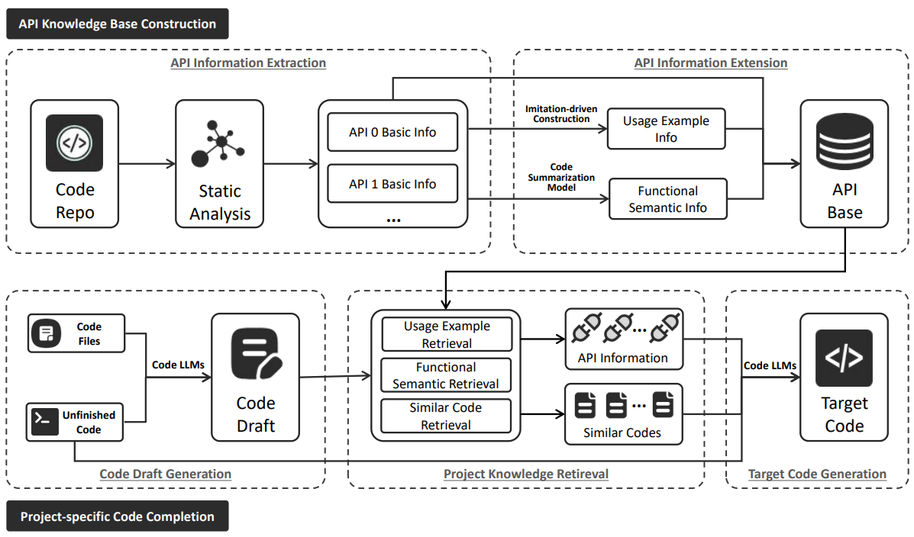

# Enhancing Project-Specific Code Completion by Inferring Intra-Project API Information

## Overview

In this paper, we follow the RAG paradigm but explore a practical approach to infer API information. Specifically, we propose a novel project-specific knowledge retrieval method that does not rely on import statements. Our method first expands the representation of intra-project API information, including usage examples and functional semantic information. Then, we use a code draft to guide the retrieval of API information required for code completion based on these two types of information. Additionally, we develop a project-specific code completion framework that not only considers similar code but also captures the intra-project API information on which the completion depends.



## Project Structure

This project contains the basic components of our approach. Here is an overview:

```shell
|-- build_j_func_base.py # build our api knowledge database (Java)
|-- build_py_ func_base.py # build our api knowledge database (Python)
|-- build_func_prompt.py # search and build relevant api inforamtion 
|-- run.py # run the code completion pipeline
|-- utils # utility functions
|-- evaluation # evaluation scripts
|-- datasets # the input data for the code completion task
|-- repos # the checkpoints of repositories used to build our benchmark. Please email us if you need the raw data.
|-- scripts # scripts for data processing
|-- prompts # prompts for code completion
|-- predictions # the output of code completion
|-- appendix.md # the online appendix of our paper
```

## Quick Start

### Install Requirements

```sh
$ pip install -r requirements.txt
```
#### Don't forget install `vllm` and `pytorch`

### Run the Pipeline
```
1. build_function_database

2. process_infile

3. generate_api

4. build_func_prompt

5. combine_rc_and_api

6. generate_api
```