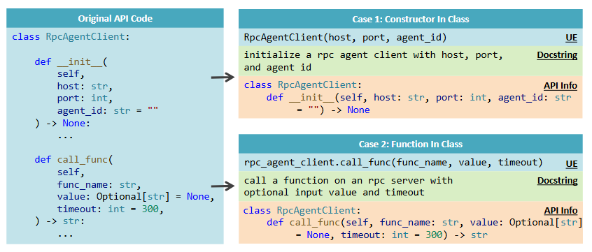
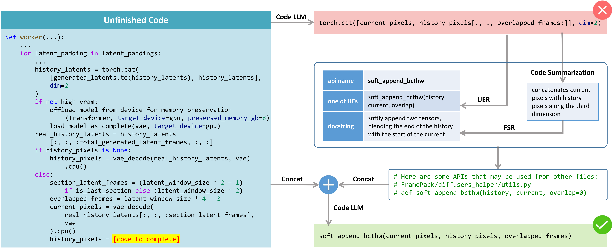

# Online Appendix

In the appendix, we provide more thorough details regarding the strategies for construction usage examples and extension study with advanced LLMs.

## A    Strategies for Constructing Function Usage Examples

To approximate real-world usage patterns of functions across different programming languages, we design language-specific heuristic strategies for generating a limited number of representative function usage examples. These examples are used to support retrieval without incurring excessive computational costs. Below, we detail the strategies used for Python and Java, along with the motivations behind each design choice.

### Python

Python’s dynamic nature and flexible function invocation syntax require careful handling to reflect realistic usage scenarios. Our strategies are as follows:

#### Regular Functions

- **Forms generated:**
  - `function_name(arguments)`
  - `filename.function_name(arguments)`
  - `function_name()`
  - `filename.function_name()`
- **Motivation:**
   Regular functions in Python can be imported directly or accessed via a module name. Including both unqualified and module-qualified names increases the likelihood of matching real usage patterns. Generating forms both with and without arguments reflects variability in context availability. Considering all possible argument combinations would lead to an explosion in the number of examples. Therefore, we adopt a simplified approach by generating only two extremes: one with all arguments included and one with none.

#### Class Functions

- **Forms generated:**
  - `class_name.function_name(arguments)`
  - `ClassName.function_name(arguments)`
     If the function is decorated with `@staticmethod` or `@classmethod`.
  - `class_name.function_name()`
  - `ClassName.function_name()`
     If the function is decorated with `@staticmethod` or `@classmethod`.
- **Motivation:**
   Python permits both instance-level and class-level access to methods, depending on the method type. We generate both object-based and class-based call patterns to reflect actual usage in object-oriented code.

#### Constructors

- **Forms generated:**
  - `ClassName(arguments)`
  - `class_name = ClassName(arguments)`
  - `ClassName()`
  - `class_name = ClassName()`
- **Motivation:**
  Object creation in Python implicitly invokes `__init__`. These forms represent realistic instantiations, optionally with assignment.

### Java

Java is a statically typed, object-oriented language with stricter syntax and richer type annotations than Python. The following strategies are designed to account for typical Java usage patterns:

#### Common Methods

- **Forms generated:**
  - `className.methodName(arguments)`
  - `ClassName.methodName(arguments)`
     If it can be called statically.
  - `TypeName typeName = className.methodName(arguments)`
     If the return type is a complex type.
- **Motivation:**
   Java differentiates between static and instance methods, so we include both access forms. For complex types (e.g., `String`, user-defined classes), variable declaration patterns are added to reflect common practice.

#### Constructors

- **Forms generated:**
  - `ClassName className = new ClassName(arguments)`
  - `new ClassName(arguments)`
- **Motivation:**
   Constructors in Java are explicitly called using `new`. We generate both forms to reflect inline and variable-assigned instantiations.

#### Inner Classes

- **Form generated:**
  - `outerInstance.innerInstance.methodName(arguments)`
- **Motivation:**
   We observe that inner classes are frequently used in Java. Java inner classes (non-static) must be instantiated through their enclosing class. This form captures realistic usage of such nested classes.

### Example Illustration



As show in the above figure, we present two examples. On the left side of the figure is the source code of a class named `RpcAgentClient`, which contains a constructor `__init__` and a class function `call_func`.

The blue box labeled *UE* on the right represents the usage example for these two functions.

- For a class constructor, we typically do not invoke it directly. Instead, we instantiate the class using the class name. Therefore, its usage example is represented as:

  ```python
  RpcAgentClient(host, port, agent_id)
  ```

- For a common function within a class, we usually call it through an object reference, where the object name often closely resembles the class name (the snake_case naming convention is commonly used in Python [PEP8]). A usage example for `call_func` is expressed as:

  ```python
  rpc_agent_client.call_func(func_name, value, timeout)
  ```

In addition to general considerations, our construction strategies also incorporate language-specific characteristics, function types (e.g., static or non-static), return types, and other relevant factors.

These strategies aim to cover the most prevalent and semantically meaningful invocation forms for each language while keeping the number of generated examples small and computationally manageable. This design enables our system to simulate practical usage scenarios in retrieval tasks better.

## B    Extension Study with Advanced LLMs

### B.1    Project Selection

The table below presents the projects used in the benchmark for evaluating advanced models.

| Project                | Created    |
| ---------------------- | ---------- |
| huggingface/nanoVLM    | 2025-05-02 |
| lllyasviel/FramePack   | 2025-04-12 |
| nari-labs/dia          | 2025-04-19 |
| Alibaba-NLP/ZeroSearch | 2025-05-07 |
| ByteDance-Seed/Bagel   | 2025-04-17 |

### B.2    Case Study



This is an example from the FramePack project, where the model is required to complete a specific line within the `worker` function. Directly prompting the model to generate this line often fails to produce an accurate completion, as it involves a project-specific API that the model has not encountered during pretraining. As a result, the model lacks the necessary information to correctly complete the code. However, by leveraging our UER and FSR components, we can infer that the intended API is likely `soft_append_bcthw`. When the relevant information about this API is provided to the model, it successfully generates the correct code.